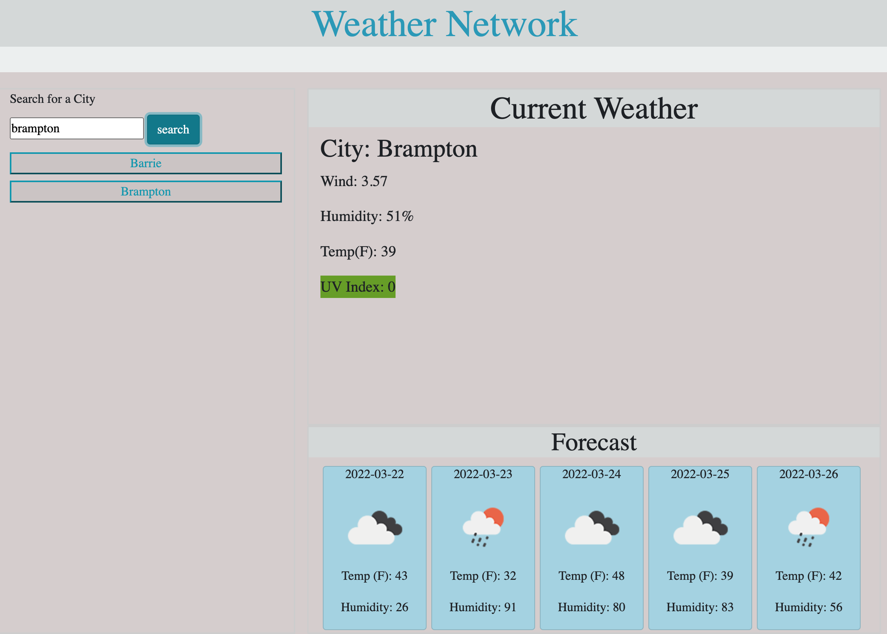

# Weather-Network

# Overview 📖
Weather-Dashboard is an application to find a weather condition of a given city both the current and 5-Days forecast at the same time.
The server-side API used to get response data object is retrieved from the Open Weather API.
# Description 📣
The current weather section is including the following weather characters and date.
* City, Date, Icon-image
* Temperature
* Humidity
* Wind Speed
* UV index
The 5-days weather forecast also displays below the current weather conditions section and it includes the following information for each day:
* Date
* Icon image
* Temperature
* Humidity
The local storage is used here to store the previous search city and display them to the user in the left side of the page under the list group. The user can also clear the search history by clicking the clear history button.
If the user wants to see the past search city weather condition again, just click the list group item cities under the clear history button.
When the user enters the city name  in the input box and press search button, “displayWeather” function will be fired up and current weather function will be call to display the current and 5-days forecast weather condition on the page.

# Deployed

[Weather-Network](https://pawan495.github.io/Weather-Network/)
# Screen Shot

# Bonus 🏆
University of Toronto BootCamp: course material, Instructor, W3Schools and google(https://www.google.com)
